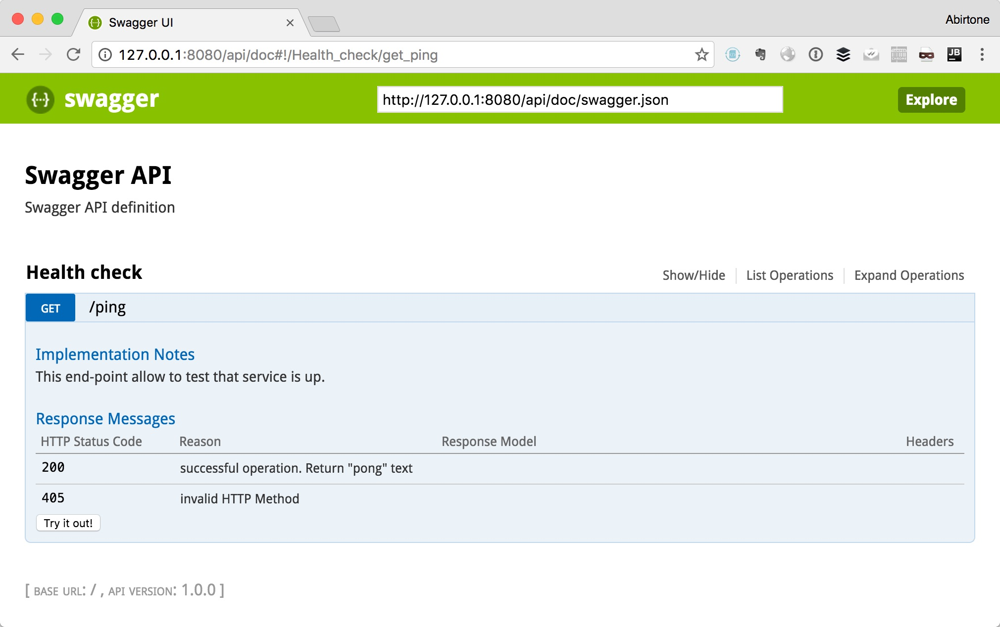

aiohttp-swagger
===============


*aiohttp-swagger: Swagger API Documentation builder for aiohttp server*

Code | https://github.com/cr0hn/aiohttp-swagger
---- | ----------------------------------------------
Issues | https://github.com/cr0hn/aiohttp-swagger/issues/
Python version | Python 3.5 and above

What's aiohttp-swagger
----------------------

aiohttp-swagger is a plugin for aiohttp.web server that allow to document APIs using Swagger show the Swagger-ui console. 

Installation
------------

### Simple

Install aiohttp-swagger is so easy:

```
$ python3.5 -m pip install aiohttp-swagger
```

With extra performance
++++++++++++++++++++++

Aiohttp-swagger also includes some optional dependencies to add extra performance but requires a bit different installation, because they (usually) depends of C extensions.

To install the tool with extra performance you must do:

```
$ python3.5 -m pip install 'aiohttp-swagger[performance]'
```

**Remember that aiohttp-swagger only runs in Python 3.5 and above**.

Quick start
-----------

Document an API is so simple:

```python

from aiohttp import web
from aiohttp_swagger import *


async def ping(request):
    """
    ---
    description: This end-point allow to test that service is up.
    tags:
    - Health check
    produces:
    - text/plain
    responses:
        "200":
            description: successful operation. Return "pong" text
        "405":
            description: invalid HTTP Method
    """
    return web.Response(text="pong")


app = web.Application()
app.router.add_route('GET', "/ping", ping)

setup_swagger(app)

web.run_app(app, host="127.0.0.1")
```

It produces:



Adding Swagger from external file
---------------------------------

Per End-Point level
+++++++++++++++++++

We can add the Swagger doc from an external YAML file at end-point level. You only need to decorate the end-point function handler:

```python

from aiohttp import web
from aiohttp_swagger import *


@swagger_path("example_swagger_partial.yaml")  # <-- Load Swagger info from external file
async def example_2(request):
    """
    Example 3 handler description. This description is only for Sphinx.
    """
    return web.Response(text="Example")


async def example_3(request):
    """
    Description end-point
    """
    return web.Response(text="Example")

app = web.Application()

app.router.add_route('GET', "/example1", example_1)
app.router.add_route('GET', "/example2", example_2)

setup_swagger(app)

web.run_app(app, host="127.0.0.1")

```

External file must have this format:

```yaml

tags:
- user
summary: Create user
description: This can only be done by the logged in user.
operationId: examples.api.api.createUser
produces:
- application/json
parameters:
- in: body
  name: body
  description: Created user object
  required: false
  schema:
    type: object
    properties:
      id:
        type: integer
        format: int64
      username:
        type:
          - "string"
          - "null"
      firstName:
        type: string
      lastName:
        type: string
      email:
        type: string
      password:
        type: string
      phone:
        type: string
      userStatus:
        type: integer
        format: int32
        description: User Status
responses:
  "201":
    description: successful operation

```

**Pay attention that file doesn't contain information about HTTP Method o End-Point name. This information will be added automatically**.

Global Swagger YAML
+++++++++++++++++++

aiohttp-swagger also allow to build an external YAML Swagger file and load it before:

```python

    from aiohttp import web
    from aiohttp_swagger import *

    async def ping(request):
        """
        This is my usually Sphinx doc
    
        >>> import json
        >>> ping(None)
        
        :param request: Context injected by aiohttp framework
        :type request: RequestHandler
        """
        return web.Response(text="pong")

    app = web.Application()
    
    app.router.add_route('GET', "/ping", ping)
    
    setup_swagger(app, swagger_from_file="example_swagger.yaml")  # <-- Loaded Swagger from external YAML file
    
    web.run_app(app, host="127.0.0.1")
```

F.A.Q.
------

Q: Where start the Swagger documentation in my function doc?
A: aiohttp-swagger try to find the string **---**. When it find this string pattern, the next text until the end of function are considered Swagger doc.

Q: Can I Combine the Swagger documentation with my usually Sphinx doc?
A: Sure! Your Sphinx doc must be first of the **---** limiter.

```python

async def ping(request):
    """
    This is my usually Sphinx doc
    
    >>> import json
    >>> ping(None)
    
    :param request: Context injected by aiohttp framework  
    :type request: RequestHandler 
    
    ---
    description: This end-point allow to test that service is up.
    tags:
    - Health check
    produces:
    - text/plain
    responses:
        "200":
            description: successful operation. Return "pong" text
        "405":
            description: invalid HTTP Method
    """
```

Q: How can I group a list of End-Point?
A: End-Point will be grouped by their title. The end-point with the same title will be grouped automatically:


Q: How can I change the Title of a group of End-Points?
A: Swagger has a tag that uses to build the titles. The tag name is **tags**. The format is:
 
```yaml
tags:  # <-- TAG USEF FOR THE TITLE
- Health check
description: This end-point allow to test that service is up.
produces:
- text/plain
responses:
    "200":
        description: successful operation. Return "pong" text
    "405":
        description: invalid HTTP Method
```

Q: What happens if I use YAML file and function documentation for build Swagger doc at the same time?
A: If two method are provided, aiohttp-swagger will use the YAML over the function doc.

Swagger Documentation & Examples
--------------------------------

You can read the Swagger parameters and format at:

    OpenAPI Spec: https://github.com/OAI/OpenAPI-Specification/blob/master/versions/2.0.md
    
If you need more examples, there're some available in at folder: **aiohttp_swagger/examples**.


What's new?
-----------

Version 1.0.0
+++++++++++++

- First version released

You can read entire list in CHANGELOG file.